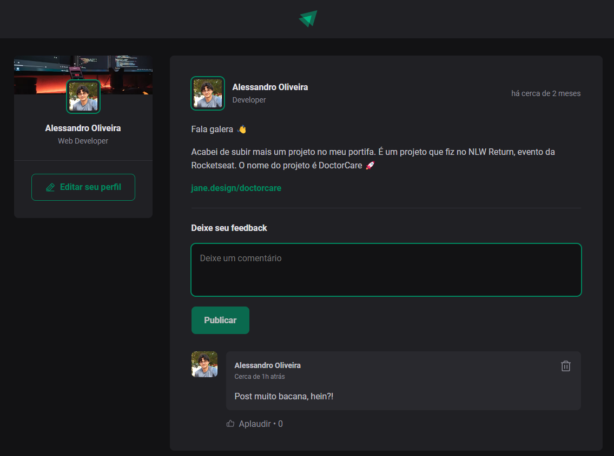

# ignite-reactjs-01-fundamento-react

## Descrição

Este projeto foi desenvolvido durante o módulo 01 do curso de ReacjJS da Rocketseat, módulo que aborda os fundamentos do React.

A aplicação utiliza o Vite a utiliza os conceitos mais importantes do React, como componentização, propriedades, estados, imutabilidade e hooks, além de aplicar TypeScript para adicionar tipagem estática à aplicação.

## Bibliotecas utilizadas

- [date-fns] (https://www.npmjs.com/package/date-fns)
- [phosphor-react] (https://www.npmjs.com/package/phosphor-react)

## Para executar a aplicação

Baixar dependências:

```shell
npm i
```

Executar o comando:

```shell
npm run dev
```

## Telas da aplicação

### Web



### Mobile


